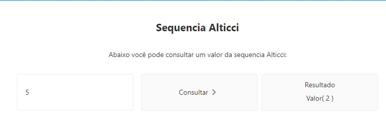

# Desafio Programação.
Nesse desafio foi apresentado uma sequencia e solicitado que fosse criado um serviço para retornar os valores dessa sequencia.

## Solução.
Minha proposta foi utilizar backend em Java com SpringBoot e um frontend em Angular.
A parte do backend eu utilizei alguns conceitos S.O.L.I.D e alguns Design patterns pensando em tornar a solução mais robusta e de mais fácil crescimento.
Deixando a solução com camadas desacopladas e fabrica de serviço.

## EndPoints
Foi criado apenas um endpoint conforme solicitado: 
/api/v1/alticci/{n}
Retorna o valor da sequencia Alticci para o indice n

## FrontEnd
Foi utilizado um frontend Angular apenas com uma pagina onde se pode inserir um indice e retorna o valor desse indice na pagina

## Configurar e Rodar
Para configurar e rodar a aplicação temos 2 componentes isolado que serão integrados nos arquivos de configuração

1. Backend (Java SpringBoot)
   - Necessita apenas ser executado conforme [Dockerfile](backend/Dockerfile)
2. Frontend (AngularJs)
    - Necessita configurar o arquivo [proxy.conf.json](frontend\my-app\proxy.conf.json) com a url onde esta aplicado o backend

Após essas simples configurações sua aplicação esta pronta e é só chamar o endereço que o serviço do angular esta escutando.